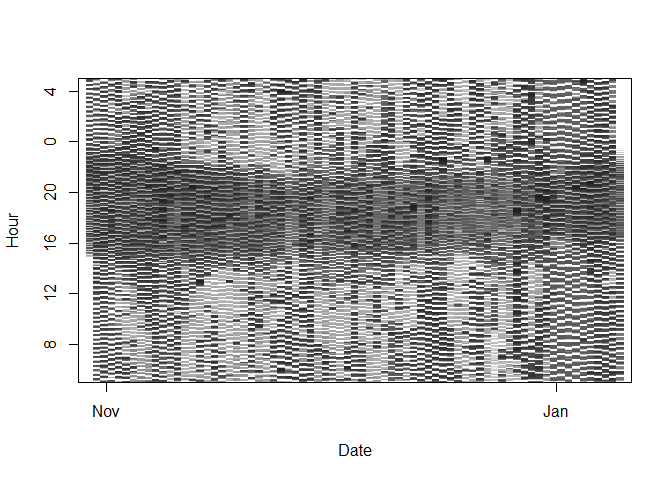
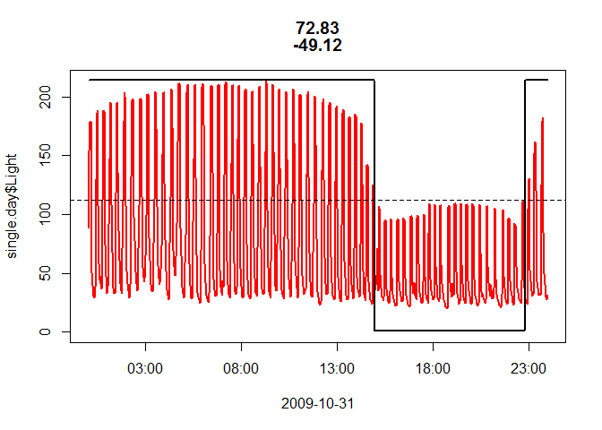
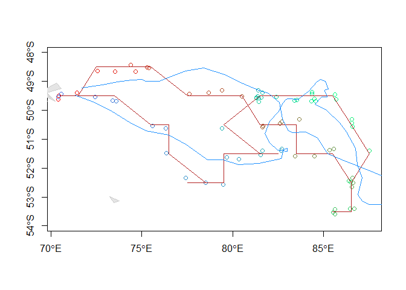
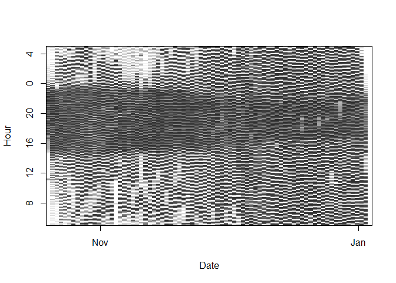
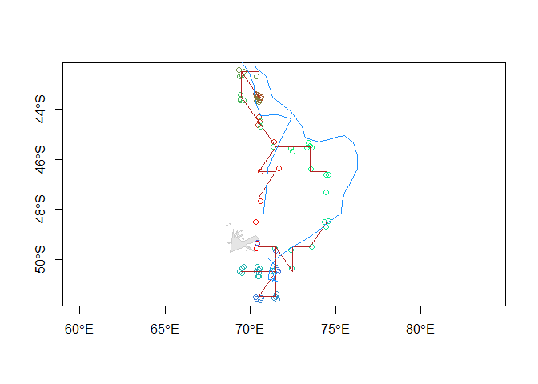
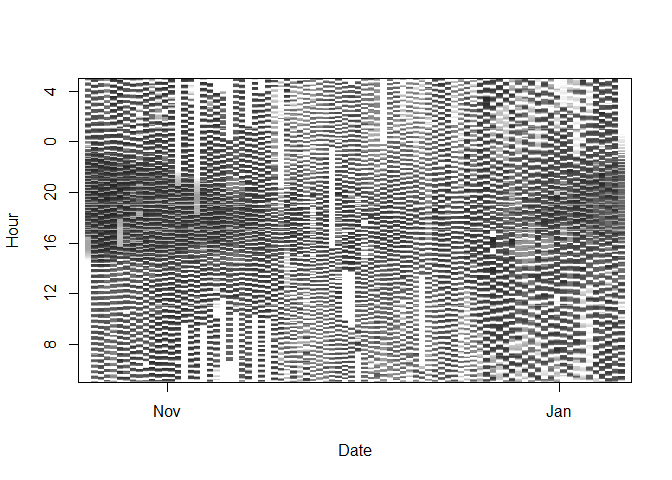
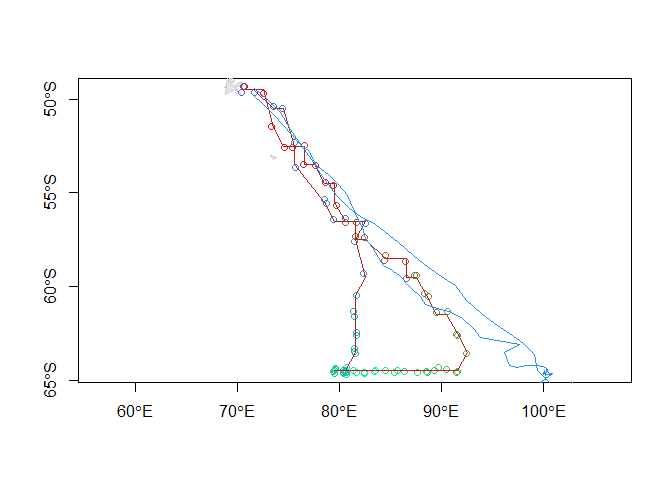
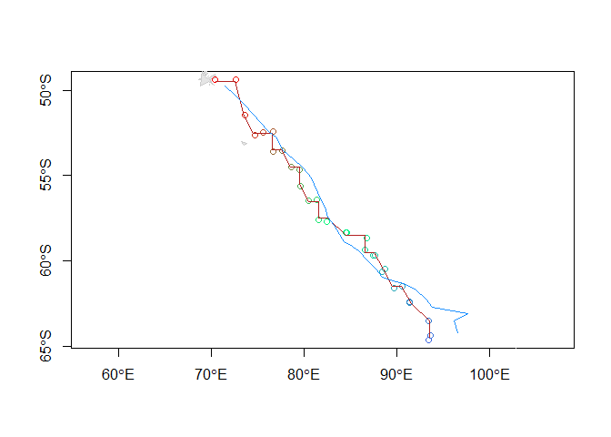
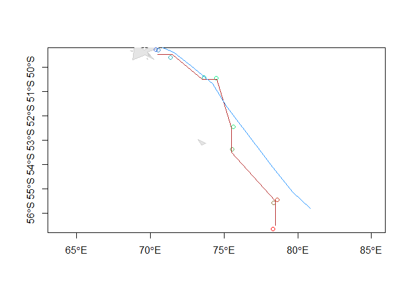

Bindoff, A.
17 July 2017

### Parameter (or hyperparameter) sensitivity

The twilight-free method of Bindoff et al. (2017) requires the user to choose shading and movement parameters, a cell size, epsilons to discard low likelihood locations, and a threshold and zenith angle. Cell size and epsilon are a trade off between speed and precision and can usually be left at 1x1 degree and 1e-6 as smaller values don't seem to confer any meaningful benefit. Threshold and zenith angle are dependent on sensor properties (and each other) and can be reliably estimated provided the tag was calibrated correctly. Optimal shading and movement parameters in a "twilight free" analysis are a function of animal behaviour. Once an optimum for an animal is determined (ideally by a double-tagging experiment), these parameters are expected to be useful in processing new data where the animal has not been double-tagged. For most species, sensor obscuration is caused by the same behaviours, and movement follows similar distributions.

Here we investigate the sensitivity of the method to these parameters (shading and movement), then test optimal parameters for one animal of one species on data from other animals of the same species, and finally we choose data from an animal displaying markedly different behaviour and investigate different parameters. In all cases the animals (southern elephant seals) were also tagged with GPS units, so their "true" positions are known (within sensor error).

#### Parameter sensitivity tag 86372

Data from a double-tagging study (GLS light logger & GPS on the same animal, tag 86372) are analysed using a new method of light-based geolocation and the results are presented in Bindoff et al. (2017). 25 tracks are reproduced using 5 shading x 5 movement parameters, and the results presented here as deviation from the GPS track as per Results in Bindoff et al.

| rmse\_lon | rmse\_lat |  gcd\_mean|  gcd\_sd|  shading|  movement|
|:----------|:----------|----------:|--------:|--------:|---------:|
| 1.39      | 1.32      |      149.9|     70.7|     0.20|    0.7500|
| 1.41      | 0.92      |      110.2|     68.3|     0.10|    0.7500|
| 1.3       | 0.63      |       83.5|     56.7|     0.04|    0.7500|
| 1.45      | 0.97      |      116.0|     68.3|     0.02|    0.7500|
| 4.68      | 2.47      |      371.2|    160.9|     0.01|    0.7500|
| 1.28      | 1.5       |      163.8|     73.4|     0.20|    0.5000|
| 1.28      | 1.11      |      124.7|     64.6|     0.10|    0.5000|
| 1.2       | 0.6       |       77.0|     51.4|     0.04|    0.5000|
| 1.34      | 0.77      |       95.2|     61.3|     0.02|    0.5000|
| 2.23      | 1.58      |      197.5|     97.9|     0.01|    0.5000|
| 1.19      | 1.84      |      194.0|     87.9|     0.20|    0.2500|
| 1.19      | 1.28      |      139.0|     66.6|     0.10|    0.2500|
| 1.05      | 0.61      |       73.3|     44.8|     0.04|    0.2500|
| 1.12      | 0.83      |       96.1|     51.8|     0.02|    0.2500|
| 1.29      | 1.86      |      198.1|     84.9|     0.01|    0.2500|
| 1.14      | 2.11      |      218.2|     99.0|     0.20|    0.1250|
| 1.13      | 1.66      |      173.9|     80.6|     0.10|    0.1250|
| 1.09      | 0.63      |       77.9|     46.4|     0.04|    0.1250|
| 1.03      | 1.06      |      109.0|     65.8|     0.02|    0.1250|
| 1.02      | 2.48      |      251.4|    113.0|     0.01|    0.1250|
| 1.17      | 2.29      |      233.5|    113.0|     0.20|    0.0625|
| 1.12      | 2.05      |      214.3|     91.6|     0.10|    0.0625|
| 1.04      | 0.98      |      107.2|     54.4|     0.04|    0.0625|
| 1.01      | 1.24      |      116.0|     87.3|     0.02|    0.0625|
| 0.99      | 3.02      |      298.0|    152.1|     0.01|    0.0625|

### Tag 86373

More GLS tag data are read from high resolution TDR files which have been resampled from 2 sec observations to 2 min observations as per previous example. Unfiltered GPS data are summarised to daily means of longitude and latitude. In this first example, the first and last few observations of GPS daily means are printed to show how deployment and retrieval locations, and a single day observation for calibration were determined. Code can be [downloaded here.](https://github.com/ABindoff/geolocationHMM/blob/master/parameter_sensitivity_new_data.Rmd)

``` r
#  raw GPS positions
gps <- "gps86373.csv"
gdat <- read_csv(gps) 
path <- group_by(gdat, Day) %>% summarise(Lon = mean(Longitude), Lat = mean(Latitude))
head(path); tail(path)
```

    ## # A tibble: 6 × 3
    ##          Day      Lon       Lat
    ##       <dttm>    <dbl>     <dbl>
    ## 1 2009-10-25 70.55621 -49.24068
    ## 2 2009-10-29 70.90227 -49.19326
    ## 3 2009-10-30 71.69701 -49.23092
    ## 4 2009-10-31 72.83593 -49.11972
    ## 5 2009-11-01 73.65033 -49.00868
    ## 6 2009-11-02 74.45576 -48.95458

    ## # A tibble: 6 × 3
    ##          Day      Lon       Lat
    ##       <dttm>    <dbl>     <dbl>
    ## 1 2010-01-06 74.32004 -50.42227
    ## 2 2010-01-07 73.35173 -50.04507
    ## 3 2010-01-08 72.40692 -49.71807
    ## 4 2010-01-09 71.33394 -49.48513
    ## 5 2010-01-10 70.34119 -49.35514
    ## 6 2010-01-14 70.21893 -49.35032

``` r
retrieved.at <- deployed.at <- c(70.5, -49.3)

#  TDR light, depth, SST previously resampled to 2 min intervals
tag <- "tdr86373.csv"
d.lig <- read_csv(tag)
d.lig$Temp <- NA

d.lig <- subset(d.lig,Date >= as.POSIXct("2009-10-29 00:00:01",tz = "UTC") &
                  Date < as.POSIXct("2010-01-10 15:00:01",tz = "UTC")) 
lightImage(d.lig, offset = 5, zlim = c(0,130))
```



The plot above shows the time series of light observations, day by day. The pixels represent the observed light, so white pixels represent bright daylight and black pixels represent complete darkness. The seal spends so much time diving that the twilight times cannot be determined precisely, and the light sensor on this tag picked up moonlight quite easily, so phases of the moon will have an effect on our threshold values (a less obvious source of 'noise').

We know (from GPS data in this case, but generally from field notes) that the tag was at 72.83, -49.12 on the 31st of October 2009 so we give what we know to `calibrate` and inspect the light trace.

``` r
zen <- 98
day <- as.POSIXct("2009-10-31 00:00:00", "UTC")
thresh <- calibrate(d.lig, day, 72.83, -49.12, zen) * 1.05
```



    ## [1] "max light in night window: 112.5 assuming a solar zenith angle of: 98"

The red line is the observed light trace. It's wiggly because the animal was diving regularly throughout the journey. The maximum light observed when the sun is below 98 degrees is indicated with a dashed line. A small margin (5%) is added to allow for moon phases.

We know where the tag deployed and retrieved so we set `retrieved.at` and `deployed.at` accordingly a build our TwilightFree model using the 'best' parameters determined for tag 86372 above.



    ##   rmse_lon rmse_lat gcd_mean   gcd_sd
    ## 1     1.47     0.47 86.64075 50.28461

Most of the error is in longitude, accuracy and precision are comparable with the analysis of tag 86372.

### Tag 78524

Using parameters determined for tag 86372 again,





    ##   rmse_lon rmse_lat gcd_mean   gcd_sd
    ## 1     1.05     1.09 115.9953 57.46792

Again, performance is comparable with the analysis of tag 86372 and 86373. Accuracy and precision are similar to other published methods where data are not as compromised by noise from shading of the sensor.

### Tag 86374



This animal clearly travelled inside the Antarctic Circle during the Austral summer, where there is no night. He spent about a month there, so our estimates during this period are very unlikely to be reliable. Under normal circumstances, we would incorporate this prior knowledge into our model by taking a subset of our data and analysing those periods for which we can make reliable estimates only. However, we have GPS data to compare to in this experiment so this is a good opportunity to see how the method performs under these "impossible" conditions (the subset will be analysed separately below).



    ##   rmse_lon rmse_lat gcd_mean   gcd_sd
    ## 1    11.38      0.7 397.8202 356.6819

As we might expect, estimates of latitude when the animal was inside the Antarctic Circle are pretty good, but longitude is impossible to estimate. This has consequences for longitude even when the animal leaves the Antarctic circle, as an artefact of the forwards-backwards algorithm. Unfortunately, incorporating SST as a covariate would (likely) not have improved this track, but a sighting on the ice would have.

We split the track into two parts with observable nights and try again.



    ##   rmse_lon rmse_lat gcd_mean   gcd_sd
    ## 1     1.37     0.52 62.15594 37.46746



    ##   rmse_lon rmse_lat gcd_mean  gcd_sd
    ## 1     1.19     0.65 71.11754 42.9106

Accuracy and precision of both parts of the piece-wise track:

    ##   rmse_lon rmse_lat gcd_mean   gcd_sd
    ## 1     1.33     0.55 64.39634 38.52562

#### PSA for tag 78524

The behaviour of the animal from which tag 78524 was retrieved was markedly different from the animal who wore tag 86372. This raises the question of how much improvement in location estimation might be gained from different movement and shading parameters. Results are reported below.

| rmse\_lon | rmse\_lat |  gcd\_mean|  gcd\_sd|  shading|  movement|
|:----------|:----------|----------:|--------:|--------:|---------:|
| 1.35      | 1         |      122.8|     63.8|     0.20|     0.500|
| 1.17      | 0.64      |       86.8|     51.9|     0.10|     0.500|
| 1.22      | 1.52      |      153.9|     82.3|     0.04|     0.500|
| 1.45      | 2.65      |      250.4|    155.9|     0.02|     0.500|
| 1.19      | 1.71      |      175.2|     88.2|     0.20|     0.250|
| 1.2       | 0.84      |      102.0|     59.2|     0.10|     0.250|
| 1.05      | 1.09      |      116.0|     57.5|     0.04|     0.250|
| 1.17      | 2.27      |      218.9|    118.8|     0.02|     0.250|
| 1.34      | 2.36      |      234.3|    130.7|     0.20|     0.125|
| 1.24      | 1.37      |      145.0|     79.9|     0.10|     0.125|
| 1.06      | 1.02      |      106.3|     64.0|     0.04|     0.125|
| 0.98      | 2.51      |      234.8|    133.2|     0.02|     0.125|
