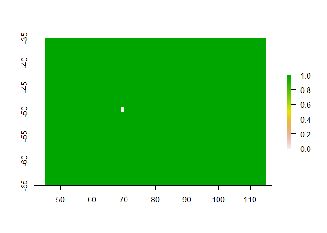
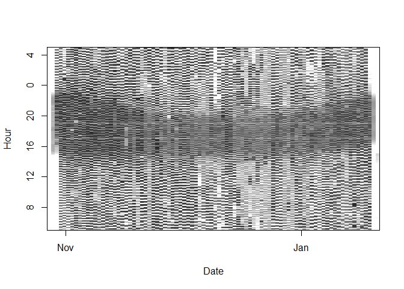
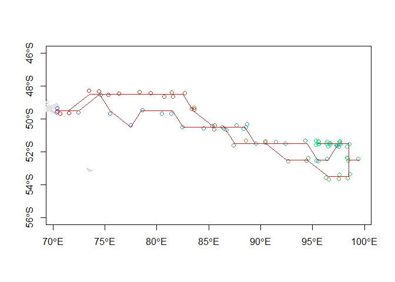

twilightfree\_quick\_start\_guide
================
Bindoff, A.
5 June 2017

# Update 2018

This git remains only as a data repository now and the quick start guide (below) is out of date. Instead, please visit https://github.com/ABindoff/TwilightFree and install the `TwilightFree` package using the instructions on that page.  

Quick-start guide to geolocation using the TwilightFree method
--------------------------------------------------------------

The TwilightFree method of light-based geolocation (Bindoff et al.) takes a sequence of light and date-time observations, and optionally sea surface temperature and known locations, to reconstruct the movements of animals. This quick-start guide introduces the functions written in R with minimal explanation, and demonstrates how to process a track using light data and known start and finish locations. Future tutorials will demonstrate how to incorporate sea surface temperature data in the analysis. If you just want to load some data and get started without learning about the functions, scroll down to "Load data and fit a model".

First we need to load some R packages. The SGAT package (<https://github.com/SWotherspoon/SGAT>) includes a function which is required by TwilightFree, and BAStag (<https://github.com/SWotherspoon/BAStag>) includes some functions which will be very helpful. Because these functions are not hosted on the CRAN repository, I have included instructions for installing them from GitHub using `devtools`. These instructions have been commented, so remove the `#` characters first if you need to install SGAT and BAStag this time. Other packages can be installed the usual way, by typing install.packages("package\_name\_here") into your console.

``` r
# install.packages("devtools")
# devtools::install_github("SWotherspoon/SGAT")
# devtools::install_github("SWotherspoon/BAStag")  
library(SGAT)
library(BAStag)
library(raster)
library(maptools)
library(readr)
```

This function constructs and returns a model which we will fit later using a forward-backward algorith. It takes a number of necessary parameters and you need to know something about them to use this method successfully, so we will go through them briefly here.

`df` is a data.frame of light and date-time observations (at a minimum). It may also contain sea surface temperature observations and other data which will be ignored. The important thing is that it has a column named `Light` and another column named `Date`.
The rows of the Light column are the light observations. There are very few restrictions on this but some tags store observations on a log scale and may need to be rescaled in order to determine a good threshold (more on this later). The rows of the Date column are the date and time data that tell us precisely when the observation occurred. It is crucial that these are in GMT or UTC time, and they need to be in POSIXct "%Y-%m-%d %H:%M:%S" format, which means a four digit year, two digit month and two digit day separated with a dash `-`, followed by hours, minutes, seconds separated with a colon `:`.
`alpha` are the hyper-parameters describing the assumed distribution of daily movements. For flexibility these are the shape and scale parameters of a Gamma distribution, and in practice the shape parameter works best set to 1. `beta` are the hyper-parameters describing the assumed distribution of shading on the sensor at or around twilight. Again, for flexibility these are the shape and scale parameters of a Gamma distribution, and in practice a shape parameter of 1 works best. `alpha` and `beta` must be chosen using prior knowledge. Although the method isn't wildly sensitive to these parameters, accuracy and precision are worthy goals. Double-tag data can be very helpful here, for example putting at least one ARGOS tag on an animal in your study. As the method is new, a database of previous tracks does not yet exist. If you have data from a double-tag study and have found optimal hyper-parameters, email the authors with the species, time of year and duration of the study, the alpha and beta hyper-parameters, and the type of satellite tag and light tag and we will add these to a database to help our community.
`zenith` refers to the solar zenith angle assumed to represent twilight. This is typically 95-97 degrees.
`threshold` refers to the ambient light level when twilight occurs. More on choosing this below.
`deployed.at` is the location at which the tag was deployed, c(lon, lat)
`retrieved.at` is the location at which the tag was retrieved, c(lon, lat)
If either of these are unknown, simply exclude those parameters and the model will estimate them from the data.

``` r
#  core algorithm of the twilight free method of Bindoff et al.
TwilightFree <- function(df,
                         alpha = c(1, 1/10),
                         beta = c(1, 1/4),
                         dt = NULL,
                         threshold = 5,
                         zenith = 96,
                         deployed.at = F,  # c(lon, lat)
                         retrieved.at = F){# c(lon, lat))) 
  # Define segment by date
  seg <- floor((as.numeric(df$Date)- as.numeric(min(df$Date)))/(24*60*60))
  # Split into `slices`
  slices <- split(df,seg)
  slices <- slices[-c(1,length(slices))]
  
  
  # fixed locations
  x0 <- matrix(0, length(slices), 2)
  x0[1,] <- deployed.at
  x0[length(slices),] <- retrieved.at
  fixed <- rep_len(c(as.logical(deployed.at[1L]),
                     logical(length(slices)-2),
                     as.logical(retrieved.at[1L])),
                     length.out = length(slices))
  
  time <- .POSIXct(sapply(slices,
                            function(d) mean(d$Date)), "GMT")
  
  ## Times (hours) between observations
  if (is.null(dt))
    dt <- diff(as.numeric(time) / 3600)
  
  
  ## Contribution to log posterior from each x location
  logpk <- function(k, x) {
    n <- nrow(x)
    logl <- double(n)
    
    ss <- solar(slices[[k]]$Date)
    obsDay <- (slices[[k]]$Light) >= threshold
    
    ## Loop over location
    for (i in seq_len(n)) {
      ## Compute for each x the time series of zeniths
      expDay <- zenith(ss, x[i, 1], x[i, 2]) <= zenith
      
      ## Some comparison to the observed light -> is L=0 (ie logl=-Inf)
      if (any(obsDay & !expDay)) {
        logl[i] <- -Inf
      } else {
        count <- sum(expDay & !obsDay)
        logl[i] <- dgamma(count, alpha[1], alpha[2], log = TRUE)
      }
    }
    ## Return sum of likelihood + prior
    logl + logp0(k, x, slices)
  }
  
  ## Behavioural contribution to the log posterior
  logbk <- function(k, x1, x2) {
    spd <- pmax.int(gcDist(x1, x2), 1e-06) / dt[k]
    dgamma(spd, beta[1L], beta[2L], log = TRUE)
  }
  
  list(
    logpk = logpk,
    logbk = logbk,
    fixed = fixed,
    x0 = x0,
    time = time,
    alpha = alpha,
    beta = beta
  )
}


logp0 <- function(k, x, slices) {
  x[, 1] <- x[, 1] %% 360
  tt <- median(slices[[k]]$Temp, na.rm = TRUE)
  if (is.na(tt)) {
    0
  } else {
    dnorm(tt, extract(sst[[indices[k]]], x), 2, log = T)
  }
}
```

Before a tag is deployed, it is good practice to collect data for a few days at a fixed location within a few degrees of latitude of where the tag will be deployed. The clock on the tag should be set precisely using UTC/GMT time first, and a GPS used to determine the fixed calibration location.
`calibrate` takes the (Light, Date) dataframe, a single day from the calibration period, the longitude and latitude the tag was calibrated at, and a guess at the solar zenith angle. From this is returns a plot of the light data trace over that day (in red), and the theoretical light (in black). These should correspond for the night period. `calibrate` returns a threshold, which is the maximum light observed during the night period. You should use calibrate for each day of calibration and choose the maximum threshold returned. You may need to change `zenith` to adjust the window of night so that this value makes sense.

``` r
# find a threshold using calibration position and date
calibrate <- function(df, day, lon, lat, zenith = 96, offset = 0, verbose = T){
  day <- day + offset*60*60  # `day` is a POSIXct date-time object usually in GMT so an `offset` parameter is provided 
                             # to quickly shift the data so that the night isn't cut off 
  single.day <- subset(df, df$Date >= as.POSIXct(day, tz = "GMT") & df$Date < as.POSIXct(day+24*60*60, tz = "GMT"))
  
  d.sim <- zenithSimulate(single.day$Date,
                          lon = rep(lon, length(single.day$Date)),
                          lat = rep(lat, length(single.day$Date)),
                          single.day$Date)
  d.sim$Light <- ifelse(d.sim$Zenith < zenith, max(single.day$Light, na.rm = T), 1)
  thresh <- max(single.day$Light[which(d.sim$Zenith >= zenith)])
  
  if(verbose){
    plot(single.day$Date,
         single.day$Light,
         col = "red",type = "l",
         lwd = 2,
         ylim = c(0,max(single.day$Light, na.rm = T)),
         xlab = day, main = cbind(lon, lat))
    lines(d.sim$Date, d.sim$Light, lwd = 2)
    abline(h = thresh, lty = 2)
    print(paste0("max light in night window: ", thresh, " assuming a solar zenith angle of: ", zenith))
  }
  
  return(thresh)
  
}
```

TwilightFree produces the track using a grid of locations representing all the places on earth the animal is likely to have visited. You need to provide a grid to the model even if you think the animal could have gone anywhere on earth. The `make.grid` function assumes the animal is constrained to sea, but you can assume the animal is constrained to land by setting `mask = "land"` or not constrained to land or sea by setting `mask = "none"`.
You'll need to provide `make.grid` with the extents of longitude, `c(min.lon, max.lon)`, the extents of latitude `c(min.lat, max.lat)` and a `cell.size` in degrees also.

You can check your grid by calling `plot(grid)`

``` r
# make a grid with a land/sea mask for the model
make.grid <- function(lon = c(-180, 180), lat = c(-90, 90), cell.size = 1, mask = "sea") {
  data("wrld_simpl")
  nrows <- abs(lat[2L] - lat[1L]) / cell.size
  ncols <- abs(lon[2L] - lon[1L]) / cell.size
  grid <- raster(
    nrows = nrows,
    ncols = ncols,
    xmn = min(lon),
    xmx = max(lon),
    ymn = min(lat),
    ymx = max(lat),
    crs = proj4string(wrld_simpl)
  )
    grid <- rasterize(wrld_simpl, grid, 1, silent = TRUE)
    grid <- is.na(grid)
    switch(mask,
           sea = {},
           land = {
                  grid <- subs(grid, data.frame(c(0,1), c(1,0)))},
           none = {
                  grid <- subs(grid, data.frame(c(0,1), c(1,1)))
           }
    )
  return(grid)
}

grid <- make.grid(c(45, 115), c(-65, -35), cell.size = 1, mask = "sea")
plot(grid)
```



Now we have all the functions we need to fit a model, we'll load in some data and begin!

### Load data and fit a model

The data for this tutorial was recorded by a time-depth recorder attached to a southern elephant seal, and includes water pressure (depth) and temperature. These temperature data are *not* sea-surface temperature so they are not useful to us and we'll need to set them to NA so that the model doesn't try to incorporate them. Note that the columns are correctly named, with a column for `Date` and a column for `Light`, and `Date` is in the right format. A commented line has been added to show you an example of how to change `Date` to the correct format if provided in a different format.

``` r
tag <- "https://raw.githubusercontent.com/ABindoff/geolocationHMM/master/TDR86372ds.csv"
d.lig <- read_delim(tag, delim = ",", skip = 0, 
                    col_names = c("Date", "Light","Depth","Temp"))
```

    ## Parsed with column specification:
    ## cols(
    ##   Date = col_datetime(format = ""),
    ##   Light = col_double(),
    ##   Depth = col_double(),
    ##   Temp = col_double()
    ## )

``` r
d.lig$Temp <- NA
# d.lig$Date <- as.POSIXct(d.lig$Date, tz = "UTC", format = "%d/%m/%y %H:%M:%S")

d.lig <- subset(d.lig,Date >= as.POSIXct("2009-10-28 00:00:01",tz = "UTC") &
                  Date < as.POSIXct("2010-01-20 15:00:01",tz = "UTC")) 
head(d.lig)
```

    ## # A tibble: 6 x 4
    ##                  Date Light Depth  Temp
    ##                <dttm> <dbl> <dbl> <lgl>
    ## 1 2009-10-28 00:01:00 160.8   4.4    NA
    ## 2 2009-10-28 00:03:00 160.0   4.4    NA
    ## 3 2009-10-28 00:05:00 159.5   4.4    NA
    ## 4 2009-10-28 00:07:00 172.8   4.5    NA
    ## 5 2009-10-28 00:09:00 172.2   4.4    NA
    ## 6 2009-10-28 00:11:00 162.2   4.4    NA

``` r
lightImage(d.lig, offset = 5, zlim = c(0,130))
```



The plot above shows the time series. The pixels represent the observed light, so white pixels are full daylight and black pixels are complete darkness. You can only just make out night in this plot because the seal spends so much time diving deeply, and the light sensor on this tag picks up moonlight quite easily.

We select a zenith `zen <- 95` as a good starting point for finding a light threshold. We know (from GPS data in this case, but generally from field notes) that the tag was at 75.863, -47.841 on the 3rd of November 2009 so we give what we know to `calibrate` ad inspect the light traces.

``` r
zen <- 95
day <- as.POSIXct("2009-11-03 00:00:00", "UTC")

thresh <- calibrate(d.lig, day, 75.863, -47.841, zen)
```


    ## [1] "max light in night window: 138.2 assuming a solar zenith angle of: 95"

The red line is the observed light trace. It's wiggly because the animal was diving regularly throughout the journey. The maximum light observed when the sun is below 95 degrees is indicated with a dashed line. Does this look like a reasonable threshold to you? Let's try again with a different zenith and see if the apparent threshold looks more informative.

``` r
zen <- 97

thresh <- calibrate(d.lig, day, 75.863, -47.841, zen) * 1.10
```


    ## [1] "max light in night window: 116.8 assuming a solar zenith angle of: 97"

There is a trade-off here - the model deals with observations of darkness during the day really well, but it can't deal with observations of light during the night. So if we set our light threshold too low, moonlight might be interpreted as daylight by the model and it will assume that the animal was somewhere else - some place where it is still day-time.
In this case (at this latitude), a zenith of 97 is a better "fit", but we've added 10% to the value returned by `calibrate` to bump up the light threshold a little to be on the safe side.

We know where the tag deployed and retrieved so we set `retrieved.at` and `deployed.at` accordingly a build our TwilightFree model.

``` r
retrieved.at <- deployed.at <- c(70.75, -49.25)


# specify the model
model <- TwilightFree(d.lig,
                      alpha=c(1, 1/25),
                      beta=c(1, 1/5),
                      zenith = zen, threshold = thresh, 
                      deployed.at = deployed.at,
                      retrieved.at = retrieved.at)
```

Now the forward-backward algorithm has everything it needs to fit the model - a model and a grid. A 90 day track takes less than a minute on most computers, `epsilon1` and `epsilon2` tell the algorithm which cells to exclude from the algorithm at each step (these are the very low likelihood locations given the data).

``` r
# fit the model using the forward-backward algorithm, SGAT::essie
fit <- SGAT::essie(model,grid,epsilon1=1.0E-4, epsilon2 = 1E-6)
```

Let's have a look at the track - but first we need a function to turn the fitted object into a track, and another to plot it nicely.
`trip` takes the fitted object and returns a data frame with Date, Lon, Lat.
`drawTracks` takes the object returned from `trip` and plots it on a sensibly defined map.

``` r
# return a track from an essie fit
trip <- function(fit){
  trip <- data.frame(as.POSIXct(strptime(essieMode(fit)$time, "%Y-%m-%d")), essieMode(fit)$x)
  names(trip) <- c("Date", "Lon", "Lat")
  return(trip)
}

colfunc<-colorRampPalette(c("red","springgreen","royalblue"))

# plot track function
drawTracks <- function(trip, col = "firebrick", main = ""){
  xlm <- range(trip$Lon)
  ylm <- range(trip$Lat)
  
  data(wrld_simpl)
  plot(wrld_simpl,xlim=xlm,ylim=ylm,
       col="grey90",border="grey80", main = main, axes = T)
  
  points(cbind(jitter(trip$Lon), jitter(trip$Lat)), col = colfunc(nrow(trip)))
  lines(cbind(trip$Lon, trip$Lat), col = col)

}


drawTracks(trip(fit))
```


