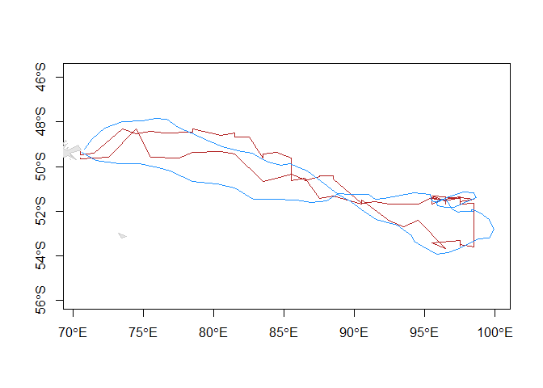

Example of Twilight Free Method - southern elephant seal dataset
================
Aidan Bindoff
26 June 2016

This is a worked example of the *twilight free algorithm* described in Chapter 2 of my Honours thesis and a paper that has been submitted describing the method in detail. Data are from a southern elephant seal that was double-tagged with a time-depth recorder that also recorded ambient light and sea surface temperature (SST), and a GPS tag. The tags were deployed and retrieved at Isles Kerguelen.

If you don't have SGAT or BAStag previously installed, then uncomment the first 3 lines of code to install these packages.

``` r
# install.packages("devtools")
# devtools::install_github("SWotherspoon/SGAT")
# devtools::install_github("SWotherspoon/BAStag")
library(SGAT)
library(BAStag)
library(raster)
library(maptools)
library(readr)

#  Main algorithm used to calculate the likelihoods
TwilightFreeModel <- function(slices,
                              alpha,beta,
                              x0,fixed=FALSE,dt=NULL,threshold=5,zenith=96, spread = 2) {
  
  
  time <- .POSIXct(sapply(slices,function(d) mean(d$Date)),"GMT")
  
  ## Times (hours) between observations
  if(is.null(dt))
    dt <- diff(as.numeric(time)/3600)
  
  
  
  ## Fixed locations
  fixed <- rep_len(fixed,length.out=length(slices))
  
  ## Contribution to log posterior from each x location
  logpk <- function(k,x) {
    
    n <- nrow(x)
    logl <- double(n)
    
    ss <- solar(slices[[k]]$Date)
    obsDay <- (slices[[k]]$Light) >= threshold
    
    ## Loop over location
    for(i in seq_len(n)) {
      
      ## Compute for each x the time series of zeniths
      expDay <- zenith(ss,x[i,1],x[i,2]) <= zenith
      
      ## Some comparison to the observed light -> is L=0 (ie logl=-Inf)
      if(any(obsDay & !expDay)) {
        logl[i] <- -Inf
      } else {
        count <- sum(expDay & !obsDay)
        logl[i] <- dgamma(count,alpha[1],alpha[2],log=TRUE)
      }
    }
    ## Return sum of likelihood + prior
    logl + logp0(k,x, spread = spread)
  }
  
  ## Behavioural contribution to the log posterior
  logbk <- function(k,x1,x2) {
    spd <- pmax.int(gcDist(x1,x2), 1e-06)/dt[k]
    dgamma(spd,beta[1L],beta[2L],log=TRUE)
  }
  
  list(
    logpk=logpk,
    logbk=logbk,
    fixed=fixed,
    x0=x0,
    time=time,
    alpha=alpha,
    beta=beta)
}


logp0 <- function(k,x, spread = spread) {
  x[,1] <- x[,1]%%360
  tt <- median(d.seg[[k]]$Temp, na.rm = TRUE) 
  if(is.na(tt)) {
    0
  } else {
    dnorm(tt,extract(sst[[indices[k]]],x),spread,log=T)
  }
}
```

Read in light data and filtered GPS locations for calibration and later comparison

``` r
#  TDR light, depth, SST previously resamples to 2 min intervals
tag <- "https://raw.githubusercontent.com/ABindoff/geolocationHMM/master/TDR86372ds.csv"
d.lig <- read_delim(tag, delim = ",", skip = 0, 
                    col_names = c("Date", "Light","Depth","Temp"))
```

    ## Parsed with column specification:
    ## cols(
    ##   Date = col_datetime(format = ""),
    ##   Light = col_double(),
    ##   Depth = col_double(),
    ##   Temp = col_double()
    ## )

``` r
head(d.lig)
```

    ## # A tibble: 6 x 4
    ##                  Date Light Depth  Temp
    ##                <dttm> <dbl> <dbl> <dbl>
    ## 1 2009-10-25 04:53:00 186.5   4.5   8.3
    ## 2 2009-10-25 04:55:00 185.2   4.5   8.7
    ## 3 2009-10-25 04:57:00 184.8   4.5   8.9
    ## 4 2009-10-25 04:59:00 173.2   4.5   9.0
    ## 5 2009-10-25 05:01:00 174.0   4.6   9.1
    ## 6 2009-10-25 05:03:00 175.5   4.5   9.1

``` r
#  filtered GPS positions
gps <- "https://raw.githubusercontent.com/ABindoff/geolocationHMM/master/86372_filteredGPS.csv"
gdat <- read_csv(gps, skip = 0, 
                   col_names = c("Date", "Lon","Lat"))
```

    ## Parsed with column specification:
    ## cols(
    ##   Date = col_datetime(format = ""),
    ##   Lon = col_double(),
    ##   Lat = col_double()
    ## )

``` r
head(gdat)
```

    ## # A tibble: 6 x 3
    ##                  Date      Lon       Lat
    ##                <dttm>    <dbl>     <dbl>
    ## 1 2009-10-29 15:44:00 70.55873 -49.24110
    ## 2 2009-10-29 16:10:00 70.58428 -49.24125
    ## 3 2009-10-29 16:38:00 70.59380 -49.25927
    ## 4 2009-10-29 17:54:00 70.70666 -49.28123
    ## 5 2009-10-29 18:15:00 70.73378 -49.27229
    ## 6 2009-10-29 18:36:00 70.76147 -49.26509

The original GLS tag data was not intended to produce location estimates and was not calibrated for this purpose. Instead, we will use the first 7 days GPS data to make an approximate calibration.

``` r
compare.light <- function(day, lon, lat, zenith = 96, offset = 0, verbose = T){
  single.day <- subset(d.lig, d.lig$Date >= as.POSIXct(day, tz = "GMT")+offset*60*60 & d.lig$Date < as.POSIXct(day+24*60*60, tz = "GMT")+offset*60*60)
  
  d.sim <- zenithSimulate(single.day$Date, lon = rep(lon, length(single.day$Date)), lat = rep(lat, length(single.day$Date)), single.day$Date)
  d.sim$Light0 <- ifelse(d.sim$Zenith<zenith,max(single.day$Light, na.rm = T),1)
  d.sim$Light <- d.sim$Light0
  thresh <- max(single.day$Light[which(d.sim$Zenith >= zenith)])
  
  if(verbose){
    plot(single.day$Date, single.day$Light, col = "red",type = "l", lwd = 2, ylim = c(0,max(single.day$Light, na.rm = T)), xlab = day, main = cbind(lon, lat))
    lines(d.sim$Date, d.sim$Light, lwd = 2)
    abline( h = thresh, lty = 2)
    print(paste0("max light in night window: ", thresh, " assuming a solar zenith angle of: ", zenith))
  }
  
  return(thresh)
}

# calibrate on first 7 days GPS data
thresh <- 5
zen <- 97
day <- as.POSIXct("2009-10-29 00:00:00", "UTC")

for(i in 1:7){
  dd <- day + i*60*60
  med.lon <- median(subset(gdat$Lon, gdat$Date >= dd & gdat$Date <= dd+24*60*60), na.rm = T)
  med.lat <- median(subset(gdat$Lat, gdat$Date >= dd & gdat$Date <= dd+24*60*60), na.rm = T)
  
  j <- compare.light(day+i*60*60, med.lon, med.lat, zenith = zen, offset = 5.5, verbose = F)
  if(j > thresh){ 
    thresh <- j
  }
}
#thresh <- 129.2  zen <- 97
```

This plot shows how noisy the data are

``` r
#  figure showing the whole light record for the period chosen
offset =5
d.lig <- subset(d.lig,Date >= as.POSIXct("2009-10-28 00:00:01",tz = "UTC") &
                  Date < as.POSIXct("2010-01-20 15:00:01",tz = "UTC")) 
lightImage(d.lig, offset = 5, zlim = c(0,130))
```


Discretise the light data into 24 hour periods as per Methods

``` r
## Define segment by date
seg <- floor((as.numeric(d.lig$Date)- as.numeric(min(d.lig$Date)))/(24*60*60))
## Split into segments
d.seg <- split(d.lig,seg)
## Drop first and last
d.seg <- d.seg[-c(1,length(d.seg))]
```

Discretise the spatial domain into a grid of cells. The example in the paper uses a 1/4x1/4 degree grid. In the interests of reduced processing time, use a 1x1 degree grid.

``` r
# create the grid
library(maptools)
data("wrld_simpl")
## Cells per degree, define Lat min and max (xmn, xmx) and Lon (ymn, ymx)
## adjust nrows, ncols to get a feel for the sensitivity at difference cell sizes
grid <- raster(nrows = 30, ncols = 70,
               xmn=45, xmx=115, ymn=-65, ymx=-35,
               crs=proj4string(wrld_simpl))

grid <- rasterize(wrld_simpl,grid,1,silent=TRUE)
## Mask must be non-zero for sea
grid <- is.na(grid)


burrow1 <- burrow2 <- c(70.75, -49.25)  #from med.lon, med.lat on start and end days

## Make some initial track we only use the start and end points from
x0 <- matrix(0,length(d.seg),2)
x0[1,] <- burrow1; x0[length(d.seg), ] <- burrow2
# if the starting point is defined by burrow, make the first entry 'T'
# and if the animal returns to the burrow, make the last entry 'T' also
fixed <- c(T,logical(length(d.seg)-2),T)
```

Calculate likelihoods and fit the model using the forward-backward algorithm described in the Methods.

``` r
# define the parameters
params <- c(1, 1/25, 1, 1/4, 1.0E-4)

# specify the model
model <- TwilightFreeModel(d.seg,
                           alpha=c(params[1],params[2]),
                           beta=c(params[3],params[4]),
                           x0=x0, zenith = zen, threshold = thresh, fixed=fixed, spread = 2)


# fit the model using the forward-backward algorithm, SGAT::essie
fit <- SGAT::essie(model,grid,epsilon1=1.0E-4, epsilon2 = params[5])
```

Summarise daily locations for GPS and plot estimated tracks on a map

``` r
##  function to plot GLS track over GPS track
drawTracks <- function(lon1, lat1, lon2, lat2, col1 = "firebrick", col2 = "dodgerblue", main = ""){
  xlm <- range(append(lon1, lon2))
  ylm <- range(append(lat1, lat2))
  
  data(wrld_simpl)
  plot(wrld_simpl,xlim=xlm,ylim=ylm,
       col="grey90",border="grey80", main = main, axes = T)
  
  lines(cbind(lon1, lat1), col = col1)
  lines(cbind(lon2, lat2), col = col2)
}


# summarise daily locations for GPS and plot both estimated tracks
trip <- data.frame(as.POSIXct(strptime(essieMode(fit)$time, "%Y-%m-%d")), essieMode(fit)$x)
colnames(trip) <- c("Date", "Lon", "Lat")
gdat$Day <- as.POSIXct(strptime(gdat$Date, "%Y-%m-%d"))
seg <- floor((as.numeric(gdat$Day)- as.numeric(min(gdat$Day)))/(24*60*60))
path <- aggregate(gdat[,c("Day","Lon","Lat")],list(Seg=seg),FUN=mean)
j <- subset(trip, trip$Date %in% path$Day)
k <- subset(path, path$Day %in% j$Date)
drawTracks(j$Lon, jitter(j$Lat), k$Lon, k$Lat) # jitter to show more points
```



Compare the accuracy and precision of GLS-derived position estimates with the *nearest* GPS fix for each day (to account for some of the error due to movement).

``` r
# calculate RMSE of lon, lat using mean daily GPS locations
n = length(trip$Lon)
round(sqrt((1/n)*sum((trip$Lon-path$Lon)^2)), 2)
```

    ## [1] 1.05

``` r
round(sqrt((1/n)*sum((trip$Lat-path$Lat)^2)), 2)
```

    ## [1] 0.61

``` r
# calculate gcDist to nearest GPS position on any day
j <- c()
for(i in 1:length(trip$Date)){
  k <- subset(gdat, as.POSIXct(Day) == as.POSIXct(trip$Date[i]))
  j[i] <- min(gcDist(cbind(trip$Lon[i], trip$Lat[i]), cbind(k$Lon, k$Lat)), na.rm = T)
}

mean(j)
```

    ## [1] 73.31827

``` r
sd(j)
```

    ## [1] 44.78404
